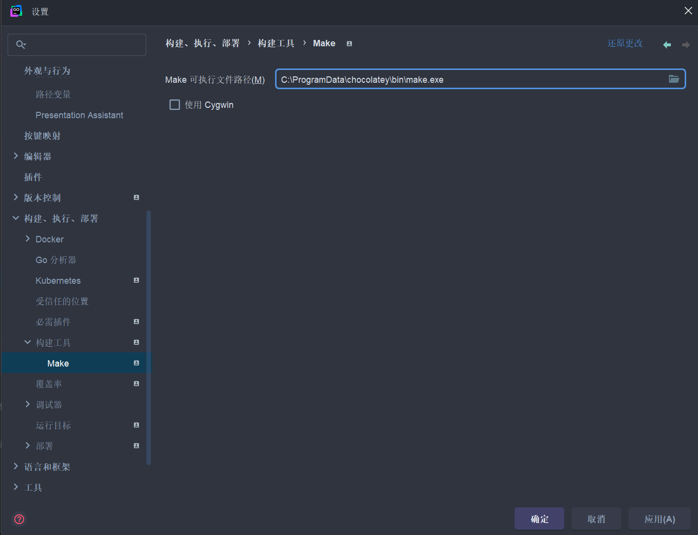

# 2025-1-30 

## 项目环境配置

### hertz框架搭建

```powershell
PS F:\goShop\goShop> go mod init goShop
go: creating new go.mod: module goShop
PS F:\goShop\goShop> go get -u github.com/cloudwego/hertz
go: added github.com/cloudwego/hertz v0.9.5
PS F:\goShop\goShop> go mod tidy
go: downloading github.com/bytedance/gopkg v0.1.0
go: downloading github.com/bytedance/sonic v1.12.0
PS F:\goShop\goShop> go run main.go
2025/01/31 00:00:44.259720 engine.go:669: [Debug] HERTZ: Method=GET    absolutePath=/ping                     --> handlerName=main.main.func1 (num=2 handlers)
2025/01/31 00:00:44.267532 engine.go:397: [Info] HERTZ: Using network library=standard
2025/01/31 00:00:44.268685 transport.go:65: [Info] HERTZ: HTTP server listening on address=[::]:8888
PS F:\goShop\goShop> curl http://localhost:8888/ping
StatusCode        : 200
StatusDescription : OK
Content           : hello world
RawContent        : HTTP/1.1 200 OK
Content-Length: 11
Content-Type: text/plain
Date: Thu, 30 Jan 2025 16:08:19 GMT
Server: hertz

hello world
Forms             : {}
Headers           : {[Content-Length, 11], [Content-Type, text/plain], [Date, Thu, 30 Jan 2025 16:08:19 GMT], [Server, hertz]}
Images            : {}
InputFields       : {}
Links             : {}
ParsedHtml        : mshtml.HTMLDocumentClass
RawContentLength  : 11
```

### 脚手架

[cwgo](https://www.cloudwego.cn/zh/docs/cwgo/) 安装

```powershell
PS F:\goShop\goShop> go install github.com/cloudwego/cwgo@latest
go: downloading github.com/cloudwego/cwgo v0.1.2
go: downloading github.com/cloudwego/hertz/cmd/hz v0.8.1
go: downloading github.com/cloudwego/thriftgo v0.3.10
go: downloading github.com/urfave/cli/v2 v2.27.1
go: downloading gorm.io/driver/postgres v1.5.7
go: downloading gorm.io/driver/sqlserver v1.5.3
go: downloading gorm.io/driver/sqlite v1.5.5
go: downloading gorm.io/gorm v1.25.9
go: downloading github.com/Masterminds/sprig/v3 v3.2.3
go: downloading github.com/fatih/camelcase v1.0.0
go: downloading golang.org/x/tools v0.20.0
go: downloading gorm.io/gen v0.3.26
go: downloading gorm.io/rawsql v1.0.2
go: downloading github.com/Masterminds/goutils v1.1.1
go: downloading github.com/Masterminds/semver/v3 v3.2.0
go: downloading github.com/huandu/xstrings v1.3.3
go: downloading github.com/google/uuid v1.4.0
go: downloading github.com/imdario/mergo v0.3.11
go: downloading github.com/shopspring/decimal v1.2.0
go: downloading github.com/mitchellh/copystructure v1.0.0
go: downloading github.com/spf13/cast v1.3.1
go: downloading golang.org/x/crypto v0.18.0
go: downloading github.com/microsoft/go-mssqldb v1.6.0
go: downloading github.com/mattn/go-sqlite3 v1.14.17
go: downloading github.com/jackc/pgx/v5 v5.4.3
go: downloading google.golang.org/protobuf v1.28.1
go: downloading gorm.io/datatypes v1.1.1-0.20230130040222-c43177d3cf8c
go: downloading gorm.io/hints v1.1.0
go: downloading gorm.io/plugin/dbresolver v1.5.0
go: downloading github.com/hashicorp/go-version v1.5.0
go: downloading github.com/mitchellh/reflectwalk v1.0.0
go: downloading github.com/cpuguy83/go-md2man/v2 v2.0.2
go: downloading github.com/xrash/smetrics v0.0.0-20201216005158-039620a65673
go: downloading golang.org/x/sync v0.7.0
go: downloading github.com/jhump/protoreflect v1.12.0
go: downloading github.com/pingcap/tidb/parser v0.0.0-20230327100244-b67c0321c05a
go: downloading github.com/jackc/pgpassfile v1.0.0
go: downloading github.com/jackc/pgservicefile v0.0.0-20221227161230-091c0ba34f0a
go: downloading github.com/golang-sql/civil v0.0.0-20220223132316-b832511892a9
go: downloading github.com/golang-sql/sqlexp v0.1.0
go: downloading golang.org/x/mod v0.17.0
go: downloading github.com/russross/blackfriday/v2 v2.1.0
go: downloading github.com/cznic/mathutil v0.0.0-20181122101859-297441e03548
go: downloading github.com/pingcap/log v0.0.0-20210625125904-98ed8e2eb1c7
go: downloading golang.org/x/exp v0.0.0-20220428152302-39d4317da171
go: downloading github.com/pingcap/errors v0.11.5-0.20210425183316-da1aaba5fb63
go: downloading go.uber.org/zap v1.24.0
go: downloading go.uber.org/multierr v1.6.0
go: downloading github.com/remyoudompheng/bigfft v0.0.0-20200410134404-eec4a21b6bb0
go: downloading github.com/benbjohnson/clock v1.1.0

```

 生成protobuf项目（以auth为例）

```powershell
PS F:\goShop\goShop> cd demo/auth
PS F:\goShop\goShop\demo\auth> go mod init auth
go: creating new go.mod: module auth
PS F:\goShop\goShop\demo\auth>  cwgo server -I ../../idl --type RPC --module auth --service auth --idl ../../idl/auth.proto
PS F:\goShop\goShop\demo\auth> go mod tidy
go: finding module for package github.com/cloudwego/kitex/pkg/rpcinfo
go: finding module for package gorm.io/driver/mysql
go: finding module for package github.com/cloudwego/kitex/pkg/serviceinfo
go: finding module for package github.com/cloudwego/kitex/server
go: finding module for package gorm.io/gorm
go: finding module for package github.com/kitex-contrib/obs-opentelemetry/logging/logrus
go: finding module for package github.com/redis/go-redis/v9
go: finding module for package go.uber.org/zap/zapcore
go: finding module for package github.com/kr/pretty
go: finding module for package gopkg.in/natefinch/lumberjack.v2
go: finding module for package gopkg.in/validator.v2
go: finding module for package github.com/cloudwego/fastpb
go: finding module for package github.com/cloudwego/kitex/pkg/klog
go: finding module for package github.com/cloudwego/kitex/client
go: finding module for package gopkg.in/yaml.v2
go: finding module for package github.com/cloudwego/kitex/client/callopt
go: downloading github.com/redis/go-redis/v9 v9.7.0
go: finding module for package github.com/cloudwego/kitex/pkg/streaming
go: downloading github.com/redis/go-redis v6.15.9+incompatible
go: downloading github.com/kitex-contrib/obs-opentelemetry v0.2.9
go: downloading github.com/kitex-contrib/obs-opentelemetry/logging/logrus v0.0.0-20241120035129-55da83caab1b
go: found github.com/cloudwego/kitex/pkg/klog in github.com/cloudwego/kitex v0.12.1
go: found github.com/cloudwego/kitex/pkg/rpcinfo in github.com/cloudwego/kitex v0.12.1
go: found github.com/cloudwego/kitex/server in github.com/cloudwego/kitex v0.12.1
go: found github.com/kitex-contrib/obs-opentelemetry/logging/logrus in github.com/kitex-contrib/obs-opentelemetry/logging/logrus v0.0.0-20241120035129-55da83caab1b
go: found go.uber.org/zap/zapcore in go.uber.org/zap v1.27.0
go: found gopkg.in/natefinch/lumberjack.v2 in gopkg.in/natefinch/lumberjack.v2 v2.2.1
go: found gorm.io/driver/mysql in gorm.io/driver/mysql v1.5.7
go: found gorm.io/gorm in gorm.io/gorm v1.25.12
go: found github.com/redis/go-redis/v9 in github.com/redis/go-redis/v9 v9.7.0
go: found github.com/kr/pretty in github.com/kr/pretty v0.3.1
go: found gopkg.in/validator.v2 in gopkg.in/validator.v2 v2.0.1
go: found gopkg.in/yaml.v2 in gopkg.in/yaml.v2 v2.4.0
go: found github.com/cloudwego/fastpb in github.com/cloudwego/fastpb v0.0.5
go: found github.com/cloudwego/kitex/client in github.com/cloudwego/kitex v0.12.1
go: found github.com/cloudwego/kitex/client/callopt in github.com/cloudwego/kitex v0.12.1
go: found github.com/cloudwego/kitex/pkg/serviceinfo in github.com/cloudwego/kitex v0.12.1
go: found github.com/cloudwego/kitex/pkg/streaming in github.com/cloudwego/kitex v0.12.1
PS F:\goShop\goShop\demo\auth> go run .
&{Env:test Kitex:{Service:auth Address::8888 LogLevel:info LogFileName:log/kitex.log LogMaxSize:10 LogMaxBackups:50 LogMaxAge:3} MySQL:{DSN:gorm:gorm@tcp(127.0.0.1:3306)/gorm?charset=utf8mb4&parseTime=True&loc=Local} Redis:{Address:127.0.0.1:6379 Username: Password: DB:0} Registry:{RegistryAddress:[127.0.0.1:2379] Username: Password:}}
```

RPC项目结构

```text
├── biz // 业务逻辑目录
│   ├── dal // 数据访问层
│   │   ├── init.go
│   │   ├── mysql
│   │   │   └── init.go
│   │   └── redis
│   │       └── init.go
│   └── service // service 层，业务逻辑存放的地方。更新时，新的方法会追加文件。
│       ├── HelloMethod.go
│       └── HelloMethod_test.go
├── build.sh
├── conf // 存放不同环境下的配置文件
│     └── ...
├── docker-compose.yaml
├── go.mod // go.mod 文件，如不在命令行指定，则默认使用相对于 GOPATH 的相对路径作为 module 名
├── handler.go // 业务逻辑入口，更新时会全量覆盖
├── kitex_info.yaml
├── kitex_gen // IDL 内容相关的生成代码，勿动
│     └── ...
├── main.go // 程序入口
├── readme.md
└── script // 启动脚本
    └── bootstrap.sh
```

## 其他

安装[Chocolatey](https://github.com/chocolatey/choco)

```powershell
Set-ExecutionPolicy Bypass -Scope Process -Force; [System.Net.ServicePointManager]::SecurityProtocol = [System.Net.ServicePointManager]::SecurityProtocol -bor 3072; iex ((New-Object System.Net.WebClient).DownloadString('https://community.chocolatey.org/install.ps1'))
```

安装make

```powershell
C:\Users\ASUS>choco install make
Chocolatey v2.4.2
Installing the following packages:
make
By installing, you accept licenses for the packages.
Downloading package from source 'https://community.chocolatey.org/api/v2/'

make v4.4.1 [Approved]
make package files install completed. Performing other installation steps.
 ShimGen has successfully created a shim for make.exe
 The install of make was successful.
  Deployed to 'C:\ProgramData\chocolatey\lib\make'

Chocolatey installed 1/1 packages.
 See the log for details (C:\ProgramData\chocolatey\logs\chocolatey.log).
```

修改路径

