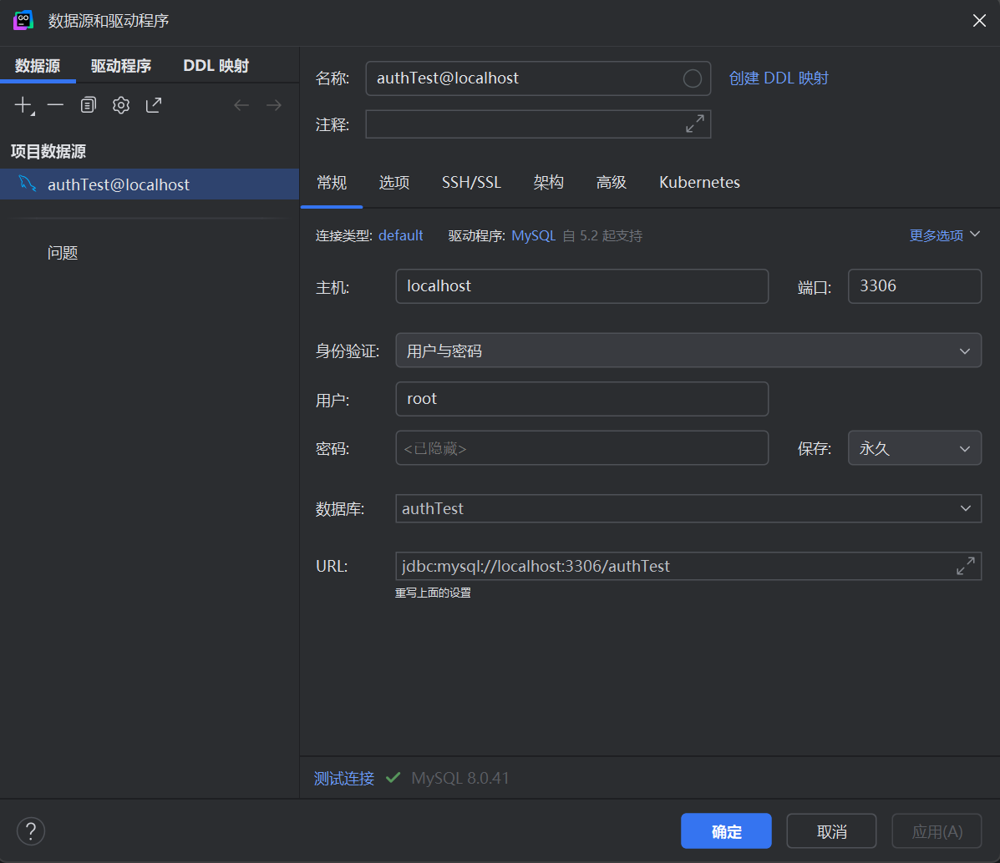
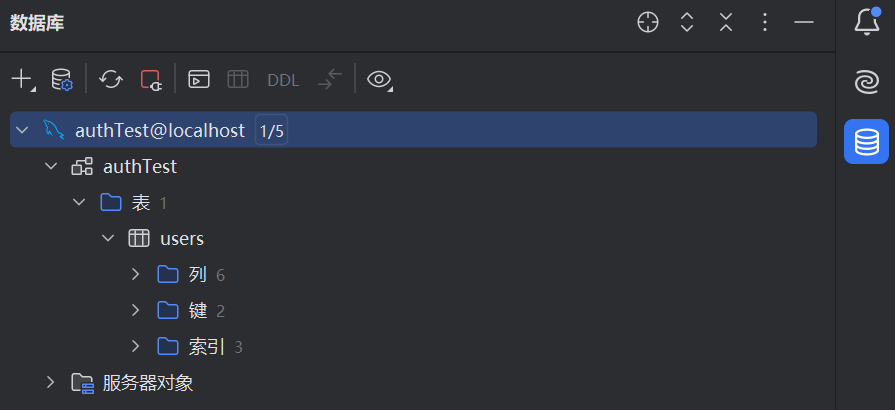
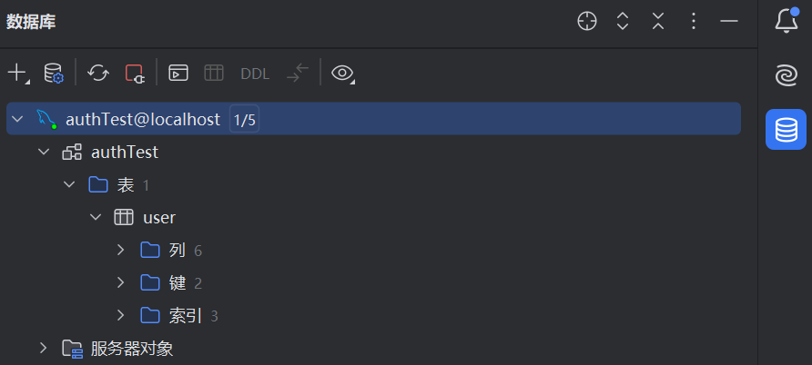
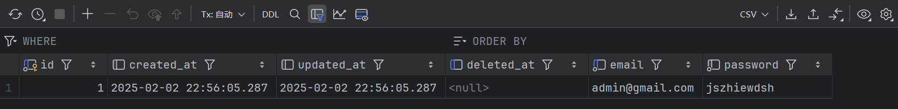
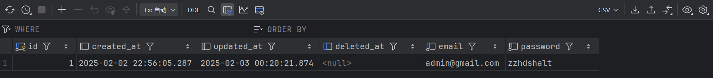
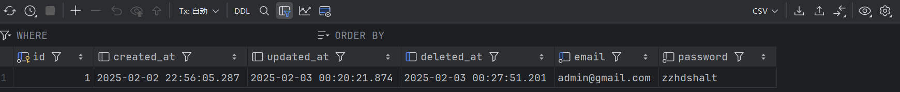
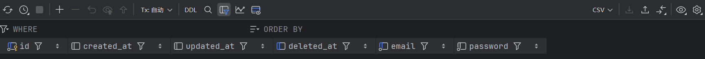

# 2025/2/2

## 使用ORM进行数据操作

### 使用[标准库](https://golang.google.cn/doc/tutorial/database-access)来访问数据

### 实际开发更多选用第三方的ORM库

[](https://entgo.io) 
[](https://gorm.io) 
[](https://xorm.io)  

### 环境改造和确认

创建测试数据库authTest

```yaml
# goShop/docker-compose.yaml
#version: "3"
services:
  consul:
    image: "consul:1.15.4"
    ports:
      - "8500:8500"
  mysql:
    image: "mysql:8.0.41"
    ports:
      - "3306:3306"
    environment:
      - MYSQL_ROOT_PASSWORD=root
      - MYSQL_DATABASE=authTest
```

```dotenv
# demo/auth/.env
MYSQL_USER=root
MYSQL_PASSWORD=root
MYSQL_HOST=localhost
MYSQL_DATABASE=authTest
```

### MySQL降级

由于前一天配置文件中使用的是latest，，今天改用8.0版本，需要先对MySQL进行降级

```powershell
PS F:\goShop\goShop> docker-compose stop mysql
[+] Stopping 1/0
 ✔ Container goshop-mysql-1  Stopped                                                                                                                                                                0.0s 
PS F:\goShop\goShop> docker-compose down -v
[+] Running 3/3
 ✔ Container goshop-consul-1  Removed                                                                                                                                                               0.4s 
 ✔ Container goshop-mysql-1   Removed                                                                                                                                                               0.0s 
 ✔ Network goshop_default     Removed      
```

### 重新启动容器

```powershell
PS F:\goShop\goShop> docker-compose up -d
[+] Running 3/3
 ✔ Network goshop_default     Created                                                                                                                                                               0.0s 
 ✔ Container goshop-mysql-1   Started                                                                                                                                                               0.5s 
 ✔ Container goshop-consul-1  Started    
```

### 测试连接



```text
DBMS: MySQL (版本 8.0.41)
区分大小写: 普通形式=exact，分隔形式=exact
驱动程序: MySQL Connector/J (版本 mysql-connector-j-8.2.0 (Revision: 06a1f724497fd81c6a659131fda822c9e5085b6c)，JDBC4.2)

Ping: 13毫秒
SSL: yes
```

### 创建数据模型

[声明模型](https://gorm.io/docs/models.html)

```go
// demo/auth/biz/model/user.go
package model

import "gorm.io/gorm"

type User struct {
	gorm.Model
	Email    string `gorm:"type:varchar(128);unique;not null"`
	Password string `gorm:"type:varchar(64);not null"`
}
```

利用[自动迁移](https://gorm.io/docs/migration.html)

```go
func Init() {
	...

	DB.AutoMigrate(&model.User{})

	fmt.Println(v)
}
```

运行

```powershell
PS F:\goShop\goShop\demo\auth> go run .
&{Env:test Kitex:{Service:auth Address::8888 LogLevel:info LogFileName:log/kitex.log LogMaxSize:10 LogMaxBackups:50 LogMaxAge:3} MySQL:{DSN:%s:%s@tcp(%s:3306)/%s?charset=utf8mb4&parseTime=True&loc=Local} Redis:{Address:127.0.0.1:6379 Username: Password: DB:0} Registry:{RegistryAddress:[127.0.0.1:8500] Username: Password:}}

2025/02/02 16:48:00 F:/goShop/goShop/demo/auth/biz/dal/mysql/init.go:47 Error 1046 (3D000): No database selected
[0.521ms] [rows:0] CREATE TABLE `users` (`id` bigint unsigned AUTO_INCREMENT,`created_at` datetime(3) NULL,`updated_at` datetime(3) NULL,`deleted_at` datetime(3) NULL,`email` varchar(128) NOT NULL,`password` varchar(64) NOT NULL,PRIMARY KEY (`id`),INDEX `idx_users_deleted_at` (`deleted_at`),CONSTRAINT `uni_users_email` UNIQUE (`email`))
{8.0.41}
```

发现报错，打印调试信息

```go
fmt.Println("DSN:", dsn) // 打印 DSN 以便调试
```

```powershell
&{Env:test Kitex:{Service:auth Address::8888 LogLevel:info LogFileName:log/kitex.log LogMaxSize:10 LogMaxBackups:50 LogMaxAge:3} MySQL:{DSN:%s:%s@tcp(%s:3306)/%s?charset=utf8mb4&parseTime=True&loc=Local} Redis:{Address:127.0.0.1:6379 Username: Password: DB:0} Registry:{RegistryAddress:[127.0.0.1:8500] Username: Password:}}
DSN: root:root@tcp(localhost:3306)/?charset=utf8mb4&parseTime=True&loc=Local

2025/02/02 22:12:35 F:/goShop/goShop/demo/auth/biz/dal/mysql/init.go:51 Error 1046 (3D000): No database selected
[0.525ms] [rows:0] CREATE TABLE `users` (`id` bigint unsigned AUTO_INCREMENT,`created_at` datetime(3) NULL,`updated_at` datetime(3) NULL,`deleted_at` datetime(3) NULL,`email` varchar(128) NOT NULL,`password` varchar(64) NOT NULL,PRIMARY KEY (`id`),INDEX `idx_users_deleted_at` (`deleted_at`),CONSTRAINT `uni_users_email` UNIQUE (`email`))
exit status 1
```

"/?"表明没有正确指定数据库名称，代码中使用的环境变量名称与前面设置的不一致

```go
// demo/auth/biz/dal/mysql/init.go
func Init() {
	dsn := fmt.Sprintf(conf.GetConf().MySQL.DSN,
		os.Getenv("MYSQL_USER"),
		os.Getenv("MYSQL_PASSWORD"),
		os.Getenv("MYSQL_HOST"),
		os.Getenv("MYSQL_DATABASE"))
	    // os.Getenv("MYSQL_ROOT_DATABASE")
	...
}	
```

检查发现运行成功

```powershell
PS F:\goShop\goShop\demo\auth> go run .
&{Env:test Kitex:{Service:auth Address::8888 LogLevel:info LogFileName:log/kitex.log LogMaxSize:10 LogMaxBackups:50 LogMaxAge:3} MySQL:{DSN:%s:%s@tcp(%s:3306)/%s?charset=utf8mb4&parseTime=True&loc=Local} Redis:{Address:127.0.0.1:6379 Username: Password: DB:0} Registry:{RegistryAddress:[127.0.0.1:8500] Username: Password:}}
DSN: root:root@tcp(localhost:3306)/authTest?charset=utf8mb4&parseTime=True&loc=Local
{8.0.41}
```



如果想指定数据表的名字，可以修改user.go文件

```go
package model

import "gorm.io/gorm"

type User struct {
	gorm.Model
	Email    string `gorm:"type:varchar(128);unique;not null"`
	Password string `gorm:"type:varchar(64);not null"`
}

func (User) TableName() string {
	return "user"
```



### 添加测试代码

```go
// demo/auth/cmd/dbop/db.go
package main

import (
	"github.com/Tinuvile/goShop/demo/auth/biz/dal"
	"github.com/Tinuvile/goShop/demo/auth/biz/dal/mysql"
	"github.com/Tinuvile/goShop/demo/auth/biz/model"

	"github.com/joho/godotenv"
)

func main() {
	err := godotenv.Load()
	if err != nil {
		panic("Error loading .env file")
	}
	dal.Init()
	// CURD
	mysql.DB.Create(&model.User{Email: "admin@gmail.com", Password: "jszhiewdsh"})                    // 创建
	mysql.DB.Model(&model.User{}).Where("email=?", "admin@gmail.com").Update("password", "zzhdshalt") // 修改

	var row model.User
	mysql.DB.Model(&model.User{}).Where("email=?", "admin@gmail.com").First(&row) // 查找

	fmt.Println("row:%+v\n", row)

	mysql.DB.Where("email=?", "admin@gmail.com").Delete(&model.User{}) // 删除

	mysql.DB.Unscoped().Where("email=?", "admin@gmail.com").Delete(&model.User{}) // 强制删除

}
```

运行

```powershell
PS F:\goShop\goShop\demo\auth> go run cmd/dbop/db.go
&{Env:test Kitex:{Service:auth Address::8888 LogLevel:info LogFileName:log/kitex.log LogMaxSize:10 LogMaxBackups:50 LogMaxAge:3} MySQL:{DSN:%s:%s@tcp(%s:3306)/%s?charset=utf8mb4&parseTime=True&loc=Local} Redis:{Address:127.0.0.1:6379 Username: Password: DB:0} Registry:{RegistryAddress:[127.0.0.1:8500] Username: Password:}}
DSN: root:root@tcp(localhost:3306)/authTest?charset=utf8mb4&parseTime=True&loc=Local
{8.0.41}

PS F:\goShop\goShop\demo\auth> go run cmd/dbop/db.go
&{Env:test Kitex:{Service:auth Address::8888 LogLevel:info LogFileName:log/kitex.log LogMaxSize:10 LogMaxBackups:50 LogMaxAge:3} MySQL:{DSN:%s:%s@tcp(%s:3306)/%s?charset=utf8mb4&parseTime=True&loc=Local} Redis:{Address:127.0.0.1:6379 Username: Password: DB:0} Registry:{RegistryAddress:[127.0.0.1:8500] Username: Password:}}
DSN: root:root@tcp(localhost:3306)/authTest?charset=utf8mb4&parseTime=True&loc=Local
{8.0.41}

PS F:\goShop\goShop\demo\auth> go run cmd/dbop/db.go
&{Env:test Kitex:{Service:auth Address::8888 LogLevel:info LogFileName:log/kitex.log LogMaxSize:10 LogMaxBackups:50 LogMaxAge:3} MySQL:{DSN:%s:%s@tcp(%s:3306)/%s?charset=utf8mb4&parseTime=True&loc=Local} Redis:{Address:127.0.0.1:6379 Username: Password: DB:0} Registry:{RegistryAddress:[127.0.0.1:8500] Username: Password:}}
DSN: root:root@tcp(localhost:3306)/authTest?charset=utf8mb4&parseTime=True&loc=Local
{8.0.41}
row:%+v
{{1 2025-02-02 22:56:05.287 +0800 CST 2025-02-03 00:20:21.874 +0800 CST {0001-01-01 00:00:00 +0000 UTC false}} admin@gmail.com zzhdshalt}

PS F:\goShop\goShop\demo\auth> go run cmd/dbop/db.go
&{Env:test Kitex:{Service:auth Address::8888 LogLevel:info LogFileName:log/kitex.log LogMaxSize:10 LogMaxBackups:50 LogMaxAge:3} MySQL:{DSN:%s:%s@tcp(%s:3306)/%s?charset=utf8mb4&parseTime=True&loc=Local} Redis:{Address:127.0.0.1:6379 Username: Password: DB:0} Registry:{RegistryAddress:[127.0.0.1:8500] Username: Password:}}
DSN: root:root@tcp(localhost:3306)/authTest?charset=utf8mb4&parseTime=True&loc=Local
{8.0.41}

PS F:\goShop\goShop\demo\auth> go run cmd/dbop/db.go
&{Env:test Kitex:{Service:auth Address::8888 LogLevel:info LogFileName:log/kitex.log LogMaxSize:10 LogMaxBackups:50 LogMaxAge:3} MySQL:{DSN:%s:%s@tcp(%s:3306)/%s?charset=utf8mb4&parseTime=True&loc=Local} Redis:{Address:127.0.0.1:6379 Username: Password: DB:0} Registry:{RegistryAddress:[127.0.0.1:8500] Username: Password:}}
DSN: root:root@tcp(localhost:3306)/authTest?charset=utf8mb4&parseTime=True&loc=Local
{8.0.41}
```

查看数据库:

- 添加



- 修改



- 删除



- 强制删除

