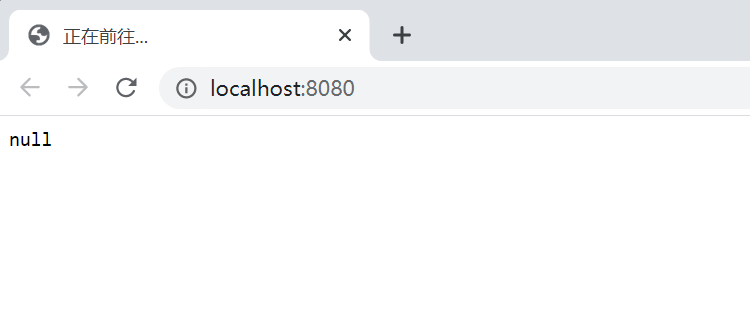
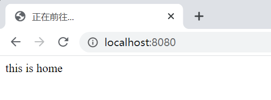

# 2025/2/5

## 前端界面

[](https://getbootstrap.com)
[](https://fontawesome.com)
[](https://golang.org/pkg/html/template/)

### 重构项目

goShop/app 放置项目代码

goShop/idl 放置接口文档

使用hz提供的注解文件[api.proto](https://www.cloudwego.io/zh/docs/hertz/tutorials/toolkit/usage-protobuf/)

```protobuf
// frontend/home.proto
syntax = "proto3";

package frontend.home;

option go_package = "frontend/home";

import "idl/api.proto";

message Empty {}

service HomeService {
  rpc Home(Empty) returns(Empty) {
    option (api.get) = "/";
  }
}
```

### 使用cwgo生成代码

```powershell
PS F:\goShop\goShop\app\frontend> cwgo server --type HTTP --idl ../../idl/frontend/home.proto --service frontend -module github.com/Tinuvile/goShop/app/frontend -I ../../idl
```

这里我又踩了一个坑，因为一开始对go管理依赖不太了解，前面生成的代码中一直是 <strong>go.mod</strong> ,
在运行这个命令的时候一直报错，一开始以为是go版本的问题，后来发现需要用 <strong>go.work</strong>来管理多模块工作区。

| 特性                     | go.mod                           | go.work                         |  
|------------------------|----------------------------------|----------------------------------|  
| 依赖优先级                | 从远程仓库或本地缓存加载依赖         | 优先使用 use 中指定的本地模块代码  |  
| 版本控制是否提交           | ✅ 需提交到 Git                  | ❌ 不提交（开发环境临时配置）       |  
| 影响范围                 | 模块内生效                        | 全局生效（作用于当前工作区）        |  
| 典型操作命令              | go mod init / go get            | go work init / go work use      |

生成项目整体结构

```text
F:\goShop\goShop\app\frontend
├── biz/             # 业务核心代码（遵循 DDD 分层设计）
├── hertz_gen/       # IDL 生成的代码（Hertz 框架自动生成）
├── conf/            # 配置文件管理
├── script/          # 辅助脚本
│
├── go.mod           # Go 模块依赖定义
├── main.go          # 服务入口文件
└── docker-compose.yaml  # Docker 本地开发环境配置
```

- 入口层 <strong>main.go</strong> ：服务启动入口，集成配置加载、路由注册、中间件初始化

```go
func main() {
// init dal
// dal.Init()
address := conf.GetConf().Hertz.Address
h := server.New(server.WithHostPorts(address))

registerMiddleware(h)

// add a ping route to test
h.GET("/ping", func(c context.Context, ctx *app.RequestContext) {
ctx.JSON(consts.StatusOK, utils.H{"ping": "pong"})
})

router.GeneratedRegister(h)

h.Spin()
}
```

- 业务逻辑层 <strong>biz/</strong>

```text
biz/
├── handler/         # HTTP 请求处理器（对接路由）
├── router/          # 路由定义
├── service/         # 业务逻辑实现（核心）
├── dal/             # 数据访问层（Database Access Layer）
└── utils/           # 通用工具函数
```

### 尝试启动服务

```powershell
PS F:\goShop\goShop\app\frontend> go run .
&{Env:test Hertz:{Service:frontend Address::8080 EnablePprof:true EnableGzip:true EnableAccessLog:true LogLevel:info LogFileName:log/hertz.log LogMaxSize:10 LogMaxBackups:50 LogMaxAge:3} MySQL:{DSN:gorm:gor
m@tcp(127.0.0.1:3306)/gorm?charset=utf8mb4&parseTime=True&loc=Local} Redis:{Address:127.0.0.1:6379 Password: Username: DB:0}}
```

访问 http://localhost:8080 



### 进行代码改造

- 新增 <strong>template</strong> 目录放置模板文件，建立 <strong>home.tmpl</strong>
- <strong>biz/handle/home/home_service.go</strong> 修改对应代码，试运行：

- 使用goLang的[热加载工具](https://github.com/air-verse/air)优化
```powershell
PS F:\goShop\goShop\app\frontend> go install github.com/air-verse/air@latest
go: downloading github.com/air-verse/air v1.61.7
go: downloading github.com/fatih/color v1.17.0
go: downloading github.com/gohugoio/hugo v0.134.3
go: downloading github.com/pelletier/go-toml v1.9.5
go: downloading golang.org/x/sys v0.25.0
go: downloading golang.org/x/text v0.18.0
go: downloading github.com/pelletier/go-toml/v2 v2.2.3
go: downloading github.com/bep/golibsass v1.2.0
go: downloading github.com/bep/godartsass v1.2.0
go: downloading github.com/tdewolff/parse/v2 v2.7.15
go: downloading github.com/bep/godartsass/v2 v2.1.0
go: downloading github.com/spf13/cast v1.7.0
go: downloading github.com/gobwas/glob v0.2.3
go: downloading github.com/spf13/afero v1.11.0
go: downloading google.golang.org/protobuf v1.34.2
go: downloading github.com/cli/safeexec v1.0.1
PS F:\goShop\goShop\app\frontend> air

__    _   ___
/ /\  | | | |_)
/_/--\ |_| |_| \_ v1.61.7, built with Go go1.23.4

mkdir F:\goShop\goShop\app\frontend\tmp
watching .
watching biz
watching biz\dal
watching biz\dal\mysql
watching biz\dal\redis
watching biz\handler
watching biz\handler\home
watching biz\router
watching biz\router\home
watching biz\service
watching biz\utils
watching conf
watching conf\dev
watching conf\online
watching conf\test
watching hertz_gen
watching hertz_gen\api
watching hertz_gen\frontend
watching hertz_gen\frontend\home
watching log
watching script
watching template
!exclude tmp
building...
running...
&{Env:test Hertz:{Service:frontend Address::8080 EnablePprof:true EnableGzip:true EnableAccessLog:true LogLevel:info LogFileName:log/hertz.log LogMaxSize:10 LogMaxBackups:50 LogMaxAge:3} MySQL:{DSN:gorm:gorm@tcp(127.0.0.1:3306)/gorm?charset=utf8mb4&parseTime=True&loc=Local} Redis:{Address:127.0.0.1:6379 Password: Username: DB:0}}
```
- 引用[Bootstrap](https://getbootstrap.com/)，此处我们采用下载 Bootstrap v5.3.3 的即用型编译代码的方式，放在 <strong>static/css</strong>和<strong>static/js</strong>两个文件夹里